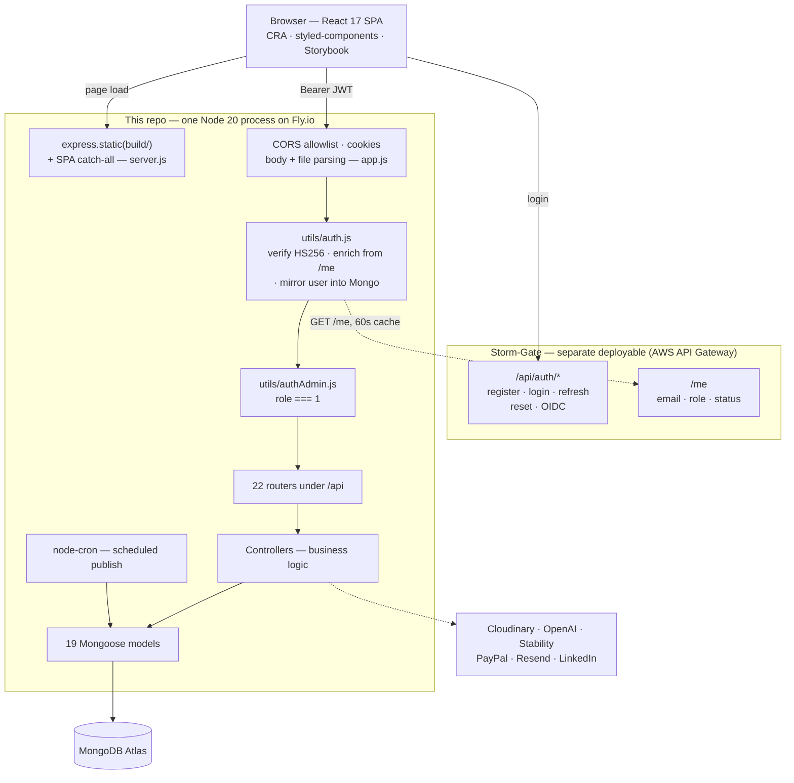
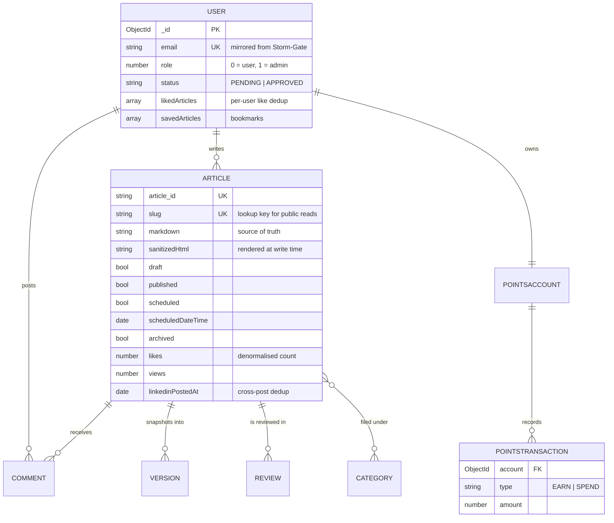

# HoseaCodes — Blog & Portfolio

[](https://github.com/HoseaCodes/Blog-Portfolio/actions/workflows/main.yaml)
[](https://github.com/HoseaCodes/Blog-Portfolio/actions/workflows/release-please.yml)
[](https://nodejs.org/)
[](https://react.dev/)
[](https://expressjs.com/)
[](https://www.mongodb.com/)
[](https://fly.io/)

🌐 **[hoseacodes.com](http://www.hoseacodes.com/)** · 📖 **[Documentation](docs/)** · 🗺️ **[Roadmap](docs/ROADMAP.md)**

A personal blog and engineering portfolio: a React SPA and the Express API behind it — articles with drafts, scheduling and versioning, a media library, AI writing assistance, SEO analysis, a newsletter, a points economy with a redemption store, and LinkedIn cross-posting.

It is a **real, deployed, single-author site**, not a demo. That shapes every decision here: authentication is delegated to a separate service rather than reimplemented, the API and the SPA ship as one deployable because one person operates them, and the parts that are honestly unfinished are listed in [Known limitations](#known-limitations) rather than quietly omitted.

```bash
git clone https://github.com/HoseaCodes/Blog-Portfolio.git && cd Blog-Portfolio
npm install --legacy-peer-deps
npm run test:integration     # 17 tests, real MongoDB via Testcontainers. Needs Docker.
```

> **Status: deployed and in use, with known gaps.** Everything described below is implemented and readable in the source. Test coverage is thin and concentrated (see [Testing](#testing-strategy)), several authorization checks are missing (see [Security](#security)), and the scheduled-publish cron does not currently fire (see [Known limitations](#known-limitations)). Those are stated because finding them undocumented would be worse than reading them here.

---

## What it demonstrates

| | |
|---|---|
| **Import-time-pure Express app** | `app.js` builds the app with **no** side effects — no DB connect, no cron, no `listen`. Tests import it directly; `server.js` owns the bootstrap. See [ADR-003](docs/adr/ADR-003-app-server-split.md) |
| **Delegated authentication** | JWT issuance, refresh, password reset and OIDC live in **Storm-Gate**, a separate service consumed via `@storm-gate/express` (server) and `@storm-gate/client` (browser). See [ADR-001](docs/adr/ADR-001-delegated-auth.md) |
| **Profile enrichment with graceful degradation** | The JWT carries only `{ id }`; role and status come from Storm-Gate's `/me`, cached 60s per id. If that call fails the request still succeeds — and admin checks fail *closed*, because `role` stays `undefined` |
| **Integration testing against a real database** | Testcontainers boots `mongo:7.0`; supertest drives the real Express app over HTTP. No mocked repositories, and `nock.disableNetConnect()` guarantees no test reaches a third party |
| **Mount-order correctness as a documented invariant** | Several routers use a no-path `router.use(auth)` catch-all, so public routes (LinkedIn OAuth callback, newsletter verify, store catalogue) **must** mount first. The rule is written at each mount site in `app.js`, because the failure mode is a silent 401 |
| **Write-time sanitisation** | Markdown is rendered and DOMPurify-sanitised in a Mongoose `pre('validate')` hook, so the stored HTML is already safe. See [ADR-006](docs/adr/ADR-006-write-time-sanitisation.md) |
| **Release automation with a single deploy path** | release-please opens a release PR on `master`; merging it tags `v*.*.*`, which fires the only workflow that deploys. Staging verifies and ships nothing |
| **CI lessons encoded, not just fixed** | The lockfile rule, the module-scope SDK rule, and the two-branch tag-collision failure are all documented in [`docs/OPERATIONS.md`](docs/OPERATIONS.md) with the mechanism, not just the remedy |
| **Product surface** | 22 routers, 19 Mongoose models: articles, comments, media, AI, SEO, analytics, collaboration, points, store, TTS, AI art, payments, projects, case studies, newsletter |

---

## Architecture



Authorization is layered, and each layer catches what the one before it cannot: the CORS allowlist rejects unknown browser origins, `auth` rejects an unsigned or expired token, `authAdmin` rejects a non-admin, and the controller applies whatever resource rule it implements. **That last layer is the weak one** — most article and blog mutations stop at "is authenticated". See [Security](#security).

Detail — module boundaries, request lifecycle, mount ordering, deployment topology: [`docs/ARCHITECTURE.md`](docs/ARCHITECTURE.md).

---

## Domain model



Users originate in **Storm-Gate**, not here. On each authenticated request `utils/auth.js` upserts a local `Users` row keyed by **email** — because Storm-Gate's id will never match a legacy blog `_id`, and this app's own collections (articles, points, comments) need a local document to reference.

`sanitizedHtml` is stored alongside `markdown` deliberately: sanitising once at write time means no read path can forget to do it. `likes` is a denormalised counter maintained with `$inc` so a like count never scans the user collection — non-atomic across two writes, which is an accepted trade for a single-author blog and is recorded as such in the source.

---

## Security

**Authentication is not implemented here — and that is the design.** Storm-Gate issues HS256 JWTs; this API only verifies them, via `createRequireAuth({ secret: ACCESS_TOKEN_SECRET })` from `@storm-gate/express`. Both services share that secret. No password ever reaches this codebase; the local `Users` mirror stores the literal string `"storm-gate-managed"` in its password field precisely so that nothing can authenticate against it.

**Profile enrichment fails closed.** The token carries only `{ id }`, so `role` and `status` are fetched from Storm-Gate's `/me` (cached 60s per id) and merged onto `req.user`:

```js
try {
  const profile = await fetchStormGateMe(req.headers.authorization, req.user.id);
  if (profile) req.user = { ...req.user, ...profile };
} catch (e) {
  console.error("[auth] Storm-Gate /me lookup failed:", e.message);
}
```

The failure is swallowed on purpose: an auth-service blip should not 500 a blog read. It is safe because `authAdmin` requires `role === 1` — on a failed lookup `role` is `undefined`, so the admin check *denies*. An integration test pins this behaviour, asserting that article creation still succeeds while `/me` is unreachable.

**Where the model is weak.** Admin gating (`authAdmin`) is applied to payments, subscribers, users, products, categories and LinkedIn. It is **not** applied to article, blog, media, AI, SEO or analytics mutations — those require only a valid token. `deleteArticle` is the clearest case: it calls `findByIdAndDelete(req.params.id)` with no ownership or role check, so any authenticated Storm-Gate user can delete any article. On a single-author site the blast radius is bounded by who can obtain a token, but it is a real gap, not a theoretical one.

Full threat model, secret handling, CORS policy, sanitisation, and the complete gap list: [`docs/SECURITY.md`](docs/SECURITY.md).

---

## Testing strategy

**75 passing tests across two tiers**, honestly distributed:

| Tier | Runner | Suites | Tests | Needs Docker |
|---|---|---|---|---|
| Integration (`test/integration`) | `npm run test:integration` | 2 | **17** | Yes |
| Unit (`test/unit`) | `npx jest` | 2 of 14 | **58** | No |

```bash
npm run test:integration   # real Express + real MongoDB, ~5s after image pull
npx jest                   # unit only, ~5s
```

**`npx jest` currently exits non-zero**, and not because anything is broken: 12 of the 14 unit files are empty placeholders, and Jest treats "no tests in this file" as a suite failure. The 58 tests that do exist are real (DOMPurify behaviour, image optimisation, media and upload controllers). This is a gap, and pretending it were a green suite would be worse than the gap.

There is **no coverage measurement and no coverage gate**. A percentage would be easy to add and easier to game; the file counts above describe the situation more truthfully than one number would.

Integration tests use **Testcontainers with `mongo:7.0`, not an in-memory substitute** — because the behaviour under test includes real unique-index enforcement, real `pre('validate')` hooks and real driver semantics, and an in-memory stand-in makes a passing test evidence about the stand-in ([ADR-004](docs/adr/ADR-004-testcontainers.md)). The container starts once for the whole run (`--runInBand`), and every collection is wiped between tests, so no test can depend on another's data.

`nock.disableNetConnect()` is on for the entire integration run, with only `127.0.0.1` allowed for supertest. A test cannot reach OpenAI, Cloudinary, Resend, or the real Storm-Gate even by accident — the suite needs **no real API keys**, and `test/setup/env.cjs` seeds placeholders before any app module evaluates.

What the suite actually proves, beyond "the endpoint responds":

- **Writes land in the database** — every mutation assertion re-reads the document, so a 200 with no persistence fails
- **Anonymous mutations write nothing** — the 401 assertion is paired with a "still absent from the DB" assertion
- **The sanitiser runs on the write path** — asserted on stored `sanitizedHtml`, not on the response body
- **Admin authorization is driven by the real `/me` response** — the same endpoint returns 200 for `role=1`, 403 for `role=0`, 401 with no token
- **Auth degrades gracefully** — creation succeeds with Storm-Gate unreachable
- **Newsletter signup is idempotent** — re-signup rotates the token instead of creating a second row

More, including what a meaningful next test would cover: [`docs/TESTING.md`](docs/TESTING.md).

---

## Reliability & operations

| Concern | Approach |
|---|---|
| Deploy | Exactly **one** path: merge the release-please PR on `master` → `v*.*.*` tag → `release-publish.yml` → Fly.io. Staging never deploys |
| CI dependency install | `npm ci --legacy-peer-deps`, never a lockfile delete — `react-scripts@4.0.3` pins `@babel/core` to `7.12.3` while floating a preset that demands `^7.16.0`, so unlocked resolution fails the build |
| Third-party SDK construction | Built **lazily inside handlers**. `app.js` imports every router at boot, so a client constructed at module scope makes the whole app unimportable without that credential — and takes the integration suite down before a single test runs |
| Outbound email | No-op unless `RESEND_API_KEY` is set — signup still records the row, delivery is skipped and logged |
| Cost control on paid APIs | TTS enforces a per-user quota and records usage; AI art is paid per generation |
| Cold starts | `min_machines_running = 0` with auto stop/start — the first request after idle pays the boot |
| Rollback | Redeploy the previous `v*` tag; Fly keeps prior releases |

The one that has actually bitten this repo: **conventional-changelog computes the next version from the last tag reachable from the branch**, while tag existence is global. Two branches running release automation in one tag namespace deadlocked on `fatal: tag already exists`, on every run, forever. The mechanism and the fix are written up in [`docs/OPERATIONS.md`](docs/OPERATIONS.md), along with health checks, log access, restart procedure, and what breaks first under load.

---

## Local development

**Prerequisites:** Node 20.x, Docker (integration tests only), a MongoDB you can reach, and a running Storm-Gate for authenticated flows.

```bash
git clone https://github.com/HoseaCodes/Blog-Portfolio.git
cd Blog-Portfolio
npm install --legacy-peer-deps      # --legacy-peer-deps is required, see below
cp ".env example" .env              # then fill in the values

# Terminal 1 — API on :3003
node server.js                      # or: npx nodemon server.js

# Terminal 2 — SPA on :3000, proxying /api to :3003
npm start
```

The SPA proxies to the API via `"proxy": "http://localhost:3003"`, with `src/setupProxy.js` force-proxying the handful of non-`/api` backend paths (`/sitemap.xml`, LinkedIn OAuth) that CRA's `Accept: text/html` heuristic would otherwise answer with the SPA shell.

Tests need **no running MongoDB** — Testcontainers manages its own.

<details>
<summary>Configuration reference</summary>

| Variable | Default | Purpose |
|---|---|---|
| `MONGODB_URL` | `mongodb://localhost:27017/` | Mongo connection string |
| `ACCESS_TOKEN_SECRET` | none | HS256 verification key — **must match Storm-Gate's signing key** |
| `STORM_GATE_URL` | `http://localhost:8081` | Where `/me` is fetched. Wrong value in production ⇒ every admin check silently denies |
| `REACT_APP_API_BASE_URL` | AWS API Gateway URL in prod, `http://localhost:8081` in dev | Storm-Gate base URL for the browser SDK |
| `CORS_ORIGINS` | `http://localhost:3000,http://localhost:3003` | Comma-separated allowlist; unknown origins are rejected |
| `PORT` | `3003` local, `8080` on Fly | HTTP port |
| `CLOUD_API_KEY` / `CLOUD_API_SECRET` / `CLOUND_NAME` | none | Cloudinary (note the spelling of the third — it is load-bearing) |
| `OPENAI_API_KEY` | none | AI writing assistance and TTS |
| `STABILITY_API_KEY` | none | AI art generation |
| `PAYPAL_CLIENT_ID` / `PAYPAL_CLIENT_SECRET` / `PAYPAL_ENV` | `sandbox` | Payments — set `live` only in production |
| `RESEND_API_KEY` / `RESEND_FROM` | none | Newsletter. Unset ⇒ email is a logged no-op |
| `LINKEDIN_CLIENT_ID` / `LINKEDIN_CLIENT_SECRET` / `LINKEDIN_REDIRECT_URI` | none | Cross-posting OAuth |
| `SITE_URL` | none | Canonical URL used in emails and social previews |
| `SWAGGER_DOCS_USER` / `SWAGGER_DOCS_PASS` | none | HTTP Basic credentials for `/api-docs` in production. Unset ⇒ the route 404s rather than opening |
| `OPENAPI_SPEC_PATH` | `<root>/api/openapi.yaml` | Override if the spec moves |

**`--legacy-peer-deps` is not optional.** React 17 with several React 18-era peer ranges will not resolve under npm 7+ strict peer resolution. Every install path — local, CI, Docker — passes the flag.

**Never delete `package-lock.json`.** See the [Operations](#reliability--operations) table for the exact failure.
</details>

---

## API documentation

**Swagger UI is served at `/api-docs`** from `api/openapi.yaml` — open in development, HTTP Basic in production. Basic rather than bearer auth because a browser navigating to a page sends no `Authorization: Bearer` header, and Basic is the only scheme a browser will negotiate on its own; with `SWAGGER_DOCS_USER`/`SWAGGER_DOCS_PASS` unset in production it **404s rather than degrading to an open page**. The spec is read lazily on first request, not at import time, so `app.js` stays importable without it.

**The spec currently describes 2 of roughly 150 endpoints.** Until it catches up, [`docs/API.md`](docs/API.md) is the real reference.

All routes are mounted under `/api`; crawler routes `/sitemap.xml` and `/blog/:slug` sit at the root.

| Family | Base | Auth |
|---|---|---|
| Articles, comments, likes, saves | `/api/articles` | Public read (`optionalAuth` adds per-viewer flags), token to write |
| Blog workflow — drafts, publish, schedule, versions, batch | `/api/blog/*` | Token |
| Media library — upload, search, folders | `/api/media/*` | Token |
| AI assistance — 13 endpoints | `/api/ai/*` | Token |
| SEO — 12 endpoints | `/api/seo/*` | Token |
| Analytics — 11 endpoints | `/api/analytics/*` | Token |
| Collaboration — reviews, collaborators, shares | `/api/collaboration/*` | Token |
| Points & store | `/api/points/*`, `/api/store/*` | Token (catalogue is public) |
| Newsletter | `/api/subscribers` | Public signup/verify, **admin** to list or broadcast |
| LinkedIn cross-posting | `/api/admin/linkedin/*` | **Admin** (OAuth callback is intentionally public) |
| Users, payments, products, categories, projects | `/api/user`, `/api/payment`, … | Mixed, mostly **admin** |

```bash
# Public read — no token
curl http://localhost:3003/api/articles

# Authenticated write — token issued by Storm-Gate
curl -X POST http://localhost:3003/api/articles \
  -H "Authorization: Bearer $TOKEN" \
  -H 'Content-Type: application/json' \
  -d '{"article_id":"demo","title":"Hello","markdown":"# Hi","images":{"url":"…"}}'
```

Responses are plain JSON and the shape is **not uniform** — some handlers return `{ success, article }`, others `{ status, article }` or `{ msg }`. That inconsistency is real and is on the [roadmap](docs/ROADMAP.md), not papered over here.

---

## Engineering decisions

Six decisions where a competent engineer could reasonably have chosen otherwise. Each [ADR](docs/adr/) states its downsides.

**[Delegate authentication to Storm-Gate](docs/adr/ADR-001-delegated-auth.md)** — this repo used to issue its own tokens and manage its own passwords. Auth is the highest-consequence, least blog-specific code in a blog, and it was being maintained twice across two projects. The cost is a hard runtime dependency on another service and an extra HTTP hop per request; the mitigation is a 60s `/me` cache and swallowed lookup failures.

**[MongoDB with Mongoose](docs/adr/ADR-002-mongodb.md)** — articles are documents with genuinely variable shape (categories, tags, per-platform cross-post metadata, embedded comments) and the write pattern is one author, occasionally. The honest cost: no foreign keys, so referential integrity between articles, users and points is application-enforced — and unenforced in several places today.

**[`app.js` builds, `server.js` boots](docs/adr/ADR-003-app-server-split.md)** — the split exists so integration tests can `import app` without a `build/` folder, a database, or a cron scheduler. Every side effect that used to sit at module scope now lives in `server.js`. This is what makes real HTTP testing possible at all.

**[Testcontainers over an in-memory Mongo](docs/adr/ADR-004-testcontainers.md)** — the tests assert unique-index rejection and `pre('validate')` behaviour. Against a substitute, a pass would be evidence about the substitute. The cost is a hard Docker dependency and ~10s of container start.

**[One deployable serving both the API and the SPA](docs/adr/ADR-005-single-deployable.md)** — one operator, one release cadence, no CORS in production, no CDN invalidation step. Also records why the auth service *is* separate, and what would change the answer.

**[Sanitise at write time, store rendered HTML](docs/adr/ADR-006-write-time-sanitisation.md)** — a `pre('validate')` hook renders markdown and runs it through DOMPurify, so no read path can forget. The cost is that changing the sanitiser policy requires a backfill.

---

## Known limitations

- **The scheduled-publish cron cannot fire.** `cron/scheduledPost.js` compares `moment().format("YYYY-MM-DD")` (a string) with `article.scheduledDateTime` (a `Date`) using `===`, which is always false. Compounding it, `min_machines_running = 0` means there may be no process awake at 12:00 CT. Scheduling through `/api/blog/schedule/:id` records the intent correctly; nothing acts on it.
- **No ownership checks on article mutations.** Any authenticated user can update or delete any article. Admin gating covers payments, subscribers, users and LinkedIn — not content.
- **The rate limiter is configured but not applied.** `app.js` builds an `express-rate-limit` instance and the `app.use(limiter)` line is commented out. No endpoint is rate-limited, including the paid AI and TTS endpoints.
- **No health endpoint.** No `/health`, no liveness/readiness split — Fly.io has only the TCP check to go on, so a process that is up but cannot reach Mongo still takes traffic.
- **12 of 14 unit test suites are empty files**, which makes `npm test` exit non-zero. No coverage is measured.
- **`react-scripts@4.0.3` and React 17** are several major versions behind, and the pinned `@babel/core` is the reason installs are lockfile-sensitive. Upgrading is a project, not a bump.
- **The Docker image runs as root** from the full `node:20` base with no multi-stage build — large, and not least-privilege.
- **Response shapes are inconsistent** across controllers (`success` vs `status` vs bare `msg`), so clients special-case per endpoint.
- **`prep` has no CI.** Checks shown on a PR targeting it are staging's runs against staging's head, and say nothing about the merge result.
- **The OpenAPI spec covers 2 endpoints.** Swagger UI is wired up and properly gated, but `api/openapi.yaml` still describes only the two article routes it was generated with, and its `servers` list includes a SwaggerHub mock.
- **No structured error contract** — no RFC 7807, no correlation ids; failures surface as `{ msg }` with a 500.

---

## Future improvements

Ranked by value, not effort:

1. **Fix the scheduled-publish comparison** and give it a test — the feature is user-visible in the admin UI and silently does nothing
2. **Ownership and role checks on content mutations**, with the negative case tested (one user cannot delete another's article)
3. **Turn the rate limiter on**, starting with the endpoints that cost money per call
4. **`/health` with a Mongo ping**, wired to a Fly.io HTTP check
5. **Fill or delete the 12 empty unit suites** so `npm test` means something
6. **A uniform response envelope** and a real error contract
7. **React 18 / Vite migration**, which retires the Babel pin and the `--legacy-peer-deps` requirement

The full product roadmap — games, shop, case studies, portfolio research — lives in [`docs/ROADMAP.md`](docs/ROADMAP.md).

---

## Documentation

| | |
|---|---|
| [`docs/ARCHITECTURE.md`](docs/ARCHITECTURE.md) | Module boundaries, request lifecycle, mount ordering, deployment topology |
| [`docs/AUTHENTICATION.md`](docs/AUTHENTICATION.md) | The Storm-Gate contract — HTTP surface, JWT claims, token flow, user status |
| [`docs/SECURITY.md`](docs/SECURITY.md) | Auth model, authorization matrix, secrets, CORS, sanitisation, gap list |
| [`docs/OPERATIONS.md`](docs/OPERATIONS.md) | CI pipelines, release and deploy, backups, restart, failure modes |
| [`docs/TESTING.md`](docs/TESTING.md) | Both tiers, the Testcontainers harness, what is and is not covered |
| [`docs/MANUAL_TESTING.md`](docs/MANUAL_TESTING.md) | Walkthrough for the enterprise blog features, which have no automated coverage |
| [`docs/METRICS.md`](docs/METRICS.md) | Performance, quality and delivery targets — and what is actually instrumented |
| [`docs/API.md`](docs/API.md) | Endpoint reference by resource family, with auth requirements |
| [`docs/FRONTEND_API.md`](docs/FRONTEND_API.md) | The `src/API/` client modules and how components consume them |
| [`docs/FRONTEND.md`](docs/FRONTEND.md) | Typography, images, delivery, performance targets, Storybook |
| [`docs/BLOG_PAGE_LOGIC.md`](docs/BLOG_PAGE_LOGIC.md) | How the `/blog` hero and "The Latest" slots are chosen |
| [`docs/GAMES.md`](docs/GAMES.md) | Score-tracking contract, `useGameScore`, points sync |
| [`docs/FEATURES.md`](docs/FEATURES.md) | Terminal, Game Zone, blog workflow, points economy, newsletter |
| [`docs/CONTRIBUTING.md`](docs/CONTRIBUTING.md) | Branches, conventional commits, PRs, releases |
| [`docs/ROADMAP.md`](docs/ROADMAP.md) | Planned work and portfolio research |
| [`docs/adr/`](docs/adr/) | Six architecture decision records |
| [`CLAUDE.md`](CLAUDE.md) | Debugging protocol for this repo — observe before hypothesising |
| [`CHANGELOG.md`](CHANGELOG.md) | Generated by release-please from conventional commits |

`docs/` supersedes the old [wiki](https://github.com/HoseaCodes/Blog/wiki), which lived on a different repository and had drifted — it still describes PM2, SendGrid and a `swagger-server` that no longer exists. Everything worth keeping from it has been folded in here, where it gets reviewed in the same pull request as the code that invalidates it.

---

## License

No license file is present, so default copyright applies: all rights reserved. If you want this to be reusable, add a `LICENSE`.
