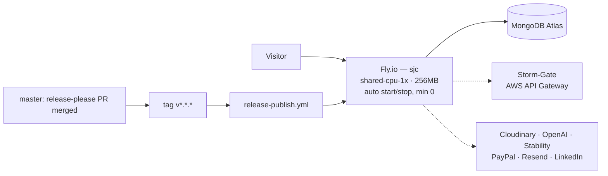

# Architecture

How this repository is put together, why the boundaries fall where they do, and which of them are load-bearing.

- [Shape of the system](#shape-of-the-system)
- [The `app.js` / `server.js` split](#the-appjs--serverjs-split)
- [Request lifecycle](#request-lifecycle)
- [Mount ordering — a real invariant](#mount-ordering--a-real-invariant)
- [Module map](#module-map)
- [Data layer](#data-layer)
- [Frontend](#frontend)
- [Scheduled work](#scheduled-work)
- [Deployment topology](#deployment-topology)
- [Third-party integrations](#third-party-integrations)

---

## Shape of the system

Two deployables, not one and not five.

| | Runs where | Owns |
|---|---|---|
| **This repo** | One Node 20 process on Fly.io | The React SPA (served statically), the `/api` surface, MongoDB access, all business logic |
| **Storm-Gate** | AWS API Gateway + Lambda | Registration, login, refresh, password reset, OIDC, and the `/me` profile endpoint |

Storm-Gate is consumed as two published packages: [`@storm-gate/express`](https://www.npmjs.com/package/@storm-gate/express) for server-side JWT verification and `@storm-gate/client` for the browser SDK (`src/lib/stormGate.js`). This repo never sees a password.

Why the split lands there and not elsewhere is [ADR-001](adr/ADR-001-delegated-auth.md) (auth is separate) and [ADR-005](adr/ADR-005-single-deployable.md) (everything else is not).

---

## The `app.js` / `server.js` split

This is the most consequential structural decision in the repository, and it is easy to undo by accident.

**`app.js` constructs the Express app and does nothing else.** No `connectDB()`, no `app.listen()`, no cron scheduling, no `express.static(build/)`. Importing it has no side effects beyond building middleware and routers.

**`server.js` is the runtime bootstrap.** It loads `dotenv` *first* — ES module imports are depth-first and controllers capture `process.env.X` at module scope, so env must be populated before `app.js` and its import tree evaluate — then layers on favicon, static serving and the SPA catch-all, connects Mongo, starts cron, and listens.

The payoff is in `test/integration/*`: a test can `require("../../app.js")` and hand it to supertest with no database, no `build/` folder, and no listening socket. Full reasoning and the constraints it imposes: [ADR-003](adr/ADR-003-app-server-split.md).

**The rule this creates:** never construct a third-party SDK client at module scope. `app.js` imports every router at boot, so a client built at import time makes the entire app unimportable without that credential — which kills the integration suite before a single test runs. Build clients lazily inside handlers. (`test/setup/env.cjs` seeds a placeholder `OPENAI_API_KEY` specifically because the OpenAI constructor throws on `undefined`.)

---

## Request lifecycle

An authenticated `POST /api/articles`:

1. **`morgan`** logs the request line.
2. **`express.json()`** parses the body.
3. **CORS** — the origin is checked against `CORS_ORIGINS` (comma-separated). A missing `Origin` header passes: that is curl, server-to-server traffic and health checks, not a browser.
4. **`cookie-parser`**, **`body-parser.urlencoded`**, **`express-fileupload`** (temp files on disk) run.
5. **Router match.** Mount order decides which router sees the request first — see below.
6. **`auth` (`utils/auth.js`)**:
   - `createRequireAuth({ secret: ACCESS_TOKEN_SECRET })` verifies the HS256 JWT. Invalid or missing ⇒ 401, and nothing further runs.
   - `GET {STORM_GATE_URL}/me` fetches `email`, `role`, `status`, cached 60s per user id in an in-process `Map`. A failure here is logged and swallowed.
   - `syncBlogUser` upserts a local `Users` document keyed by email, so this app's collections have something to reference.
7. **`authAdmin`**, where mounted, requires `role === 1` (or the string `"admin"`).
8. **Controller** executes business logic and calls Mongoose models.
9. **Model hooks** run — for articles, `pre('validate')` renders markdown to sanitised HTML.
10. **Response**, plus `res.clearCookie(...)` on the mutation paths that use the `node-cache` read cache.

The `optionalAuth` variant runs the whole chain **only if** an `Authorization` header is present, so anonymous readers pass through with `req.user` undefined while signed-in readers get per-viewer `liked` / `saved` flags on the same endpoint.

---

## Mount ordering — a real invariant

Several routers apply authentication with a no-path catch-all:

```js
router.use(auth);   // routes/store.js:15, blog.js:20, media.js:28, ai.js:22, seo.js:21, …
```

A catch-all like that intercepts **every** request reaching that router, including ones intended for a router mounted later on the same `/api` prefix. So public endpoints must be mounted first, or they 401 before their handler is ever consulted. `app.js` mounts, in order:

1. `articleRouter`, `categoryRouter`, `uploadRouter`, `paymentRouter`, `productRouter`, `projectRouter`
2. `userRouter` at `/api/user`
3. **`linkedinRouter`** — its `/callback` is deliberately un-gated, because LinkedIn's browser redirect cannot carry a JWT
4. **`subscriberRouter`** at `/api/subscribers` — public signup, verify and unsubscribe
5. **`storeRouter`** — the public `/api/store/items` catalogue feeds `/shop/redeem`
6. Everything else: media, blog, collaboration, analytics, seo, ai, aiArt, points, tts
7. Root-level crawler routes: `sitemapRouter` (`/sitemap.xml`), `socialPreviewRouter` (`/blog/:slug`)

The failure mode is a silent 401 on a route whose code is plainly public, which is exactly the kind of bug that eats an afternoon. Each of those mount lines carries a comment in `app.js` saying so. **Reordering them is a behaviour change.**

The crawler routes live in `app.js` rather than `server.js` because they have no dependency on `build/` — only the static/SPA serving does.

---

## Module map

```
app.js                  Express app — no side effects at import
server.js               Bootstrap: env → static → DB → cron → listen
config/db.js            Mongoose connection
routes/        (22)     Path → middleware → controller wiring
controllers/   (21)     Business logic
models/        (19)     Mongoose schemas and hooks
utils/                  auth, authAdmin, optionalAuth, loginRequired,
                        cache (node-cache), logger (winston), email (Resend),
                        imageOp / imageProviders, paypalClient, helperFunctions
cron/                   scheduledPost, backupDB (the latter is disabled)
src/                    React 17 SPA (CRA)
test/                   unit/, integration/, setup/, helpers/
api/openapi.yaml        OpenAPI spec, served as Swagger UI at /api-docs
.storybook/             Storybook config for src/stories
```

The layering is conventional — route → controller → model — and mostly respected. Controllers do reach into `utils/` freely, and a few do their own Mongoose queries rather than going through a repository abstraction; there is no repository layer and none is planned at this size.

---

## Data layer

MongoDB Atlas in production, `mongo:7.0` via Testcontainers in tests, defaulting to `mongodb://localhost:27017/` locally. Mongoose 8. Rationale and costs: [ADR-002](adr/ADR-002-mongodb.md).

Nineteen models. The ones that carry the most behaviour:

| Model | Notes |
|---|---|
| `article` | The centre of gravity. `pre('validate')` renders `markdown` → `sanitizedHtml`. Unique `article_id` and `slug`. Carries draft/published/scheduled/archived flags, SEO fields, cross-post state, denormalised `likes` and `views` |
| `user` | Mirror of Storm-Gate, keyed by email. `role` (0/1), `status`, `likedArticles`, `savedArticles` |
| `version` | Article snapshots for the restore path |
| `pointsAccount` / `pointsTransaction` | The points economy — balance plus an append-only-ish ledger |
| `subscriber` | Newsletter, with verify and unsubscribe tokens |
| `ttsRequest` / `ttsUsage` | Text-to-speech requests and per-user quota accounting |
| `comment`, `category`, `project`, `caseStudy`, `product`, `payment`, `artPurchase`, `collaborator`, `review`, `player`, `analytics` | The rest of the surface |

**There are no foreign keys.** Referential integrity between articles, users and points is application-enforced, and in several places not enforced at all. That is the standing cost of the document model and it is recorded as such in ADR-002.

Reads on hot list endpoints pass through `utils/cache.js` (`node-cache`) as `nodecache` middleware; mutation handlers clear the corresponding cookie.

---

## Frontend

Create React App (`react-scripts@4.0.3`, React 17), React Router 5, styled-components, Bootstrap and Material-UI, Framer Motion, Storybook.

- `src/API/*` — one hook-shaped module per resource (`ArticlesAPI`, `BlogAPI`, `MediaAPI`, `AIAPI`, `SEOAPI`, `AnalyticsAPI`, `CollaborationAPI`, `PointsAPI`, `StoreAPI`, …), each wrapping axios calls and local state.
- `src/lib/stormGate.js` — the auth SDK instance. Holds the route-classification lists (`AUTH_REQUIRED_PREFIXES`, `PUBLIC_READ_PREFIXES`) that decide when an unauthenticated response should bounce the user to `/login`, and exports `apiLocal` (authed axios at this API) and `apiStormGate` (authed axios at the auth service).
- `src/setupProxy.js` — CRA's default proxy serves the SPA shell for anything with `Accept: text/html`, which breaks address-bar visits to backend routes. This file force-proxies a fixed list (`/sitemap.xml`, `/robots.txt`, the LinkedIn OAuth pair) to `:3003` regardless.
- `src/Pages`, `src/Components`, `src/Context`, `src/Hooks`, `src/Constants` — the usual CRA layout, plus the terminal, games and easter eggs described in [FEATURES.md](FEATURES.md).

In production the built `build/` folder is served by the same Express process, so there is no separate origin and no production CORS.

---

## Scheduled work

`cron/scheduledPost.js` registers a `node-cron` job at `0 12 * * *` in `America/Chicago` to flip `scheduled` articles to `published`.

> **It cannot currently fire.** The day comparison is `moment().format("YYYY-MM-DD") === article.scheduledDateTime`, comparing a string to a `Date` with `===` — always false. And `min_machines_running = 0` means there may be no process awake at noon anyway. Fixing this properly means both a date comparison that works and a scheduler that does not depend on a machine being warm.

`cron/backupDB.js` exists but its initialiser is commented out in `server.js`.

---

## Deployment topology



One Fly.io app (`blog-portfolio-wandering-morning-3470`, primary region `sjc`), one machine class, `force_https`, internal port 8080. The Dockerfile is single-stage on the full `node:20` image, installs with `--legacy-peer-deps`, builds the SPA, and runs `node server.js` **as root** — small enough to work, not what a hardened image looks like.

Deploy is tag-driven and single-path; see [OPERATIONS.md](OPERATIONS.md).

---

## Third-party integrations

| Service | Used for | Degradation when unconfigured |
|---|---|---|
| **Storm-Gate** | Authentication, profile, roles | Requests still authenticate on signature alone; `role` is undefined, so admin checks deny |
| **MongoDB Atlas** | All persistence | Fatal |
| **Cloudinary** | Image upload, transformation, media library | Upload paths fail |
| **OpenAI** | AI writing assistance, TTS | Those routes fail; app still boots (placeholder key required for import) |
| **Stability AI** | AI art generation | AI art routes fail |
| **PayPal** | Points packs, AI art purchases | Checkout fails; sandbox by default |
| **Resend** | Newsletter verification and broadcasts | `utils/email.js` short-circuits to `{ ok: false, skipped: true }` with no network call — signup still records the row |
| **LinkedIn** | Article cross-posting | Cross-post routes fail; publishing is unaffected |
| **GetForm** | Contact form submissions | Nothing to configure — see below |

**GetForm is the odd one out.** The contact form is a **native browser POST** straight to `getform.io`, not an axios call through this API:

```jsx
<Form ref={form} action={GETFORM_ENDPOINT} method="POST" onSubmit={handleSubmit}>
```

The submit handler only fires a "processing" notification and sets a flag — it does not `preventDefault`, so the browser performs the submission and leaves the SPA. Consequences worth knowing:

- **This API never sees a contact submission.** There is no `/api/contact` route, nothing is stored in MongoDB, and messages live only in the GetForm dashboard.
- **The endpoint id is hardcoded in two places** — `src/Pages/Contact/Contact.jsx:21` and `src/Components/Form/ContactForm.jsx:30`. It is not a secret (it ships in the bundle by design), but changing forms means changing both. `ContactForm.jsx` appears to be a legacy component that nothing imports.
- **No spam protection.** A public form endpoint with no captcha or honeypot.
- **The success notification is optimistic** — it fires before the POST resolves, so a failed submission still shows "Successful Request".

Dashboards: [LinkedIn app settings](https://www.linkedin.com/developers/apps/217736152/settings) · [Resend](https://resend.com/emails)

The pattern worth copying is Resend's: an unconfigured integration should **skip loudly and continue**, not throw. It is why the integration suite can run with no real credentials at all.

---

## Notable dependencies

The stack is MERN — MongoDB, Express, React, Node — with styling across Bootstrap, Material-UI, SASS/SCSS and styled-components. Beyond the obvious, these are the ones that shape how the code reads:

| Package | Used for |
|---|---|
| `@storm-gate/express` · `@storm-gate/client` | JWT verification and the browser auth SDK ([ADR-001](adr/ADR-001-delegated-auth.md)) |
| `mongoose` | Schemas, validation, and the lifecycle hooks that hold the sanitisation invariant |
| `marked` + `dompurify` + `jsdom` | Markdown rendering and server-side sanitisation ([ADR-006](adr/ADR-006-write-time-sanitisation.md)) |
| `jsonwebtoken` | Token minting in tests; verification is Storm-Gate's |
| `axios` | HTTP client, both server and browser |
| `node-cache` | Read-path caching as `nodecache` middleware |
| `winston` · `morgan` | Application and request logging |
| `express-fileupload` · `cloudinary` · `imagemin` | Upload pipeline and image optimisation |
| `openai` · `resend` · `@paypal/react-paypal-js` | AI, email, payments |
| `node-cron` · `moment` / `moment-timezone` | Scheduled publishing |
| `express-rate-limit` | Configured, **not applied** — see [SECURITY.md](SECURITY.md#abuse-and-cost-controls) |
| `styled-components` · `framer-motion` · `aos` · `react-spring` | Styling and animation |
| `react-masonry-css` · `react-sticky-state` · `react-icons` · `react-twitter-widgets` | Layout and UI |
| `slug` / `slugify` · `uuid` | Identifiers |
| `supertest` · `nock` · `testcontainers` · `@testcontainers/mongodb` | The integration harness ([ADR-004](adr/ADR-004-testcontainers.md)) |
| `source-map-explorer` | Bundle analysis via `npm run analyze` |

Two are dead weight and should go: `@shelf/jest-mongodb`, left over from the pre-Testcontainers approach, and `aws-sdk` v2, retained only by the disabled database-backup cron.
