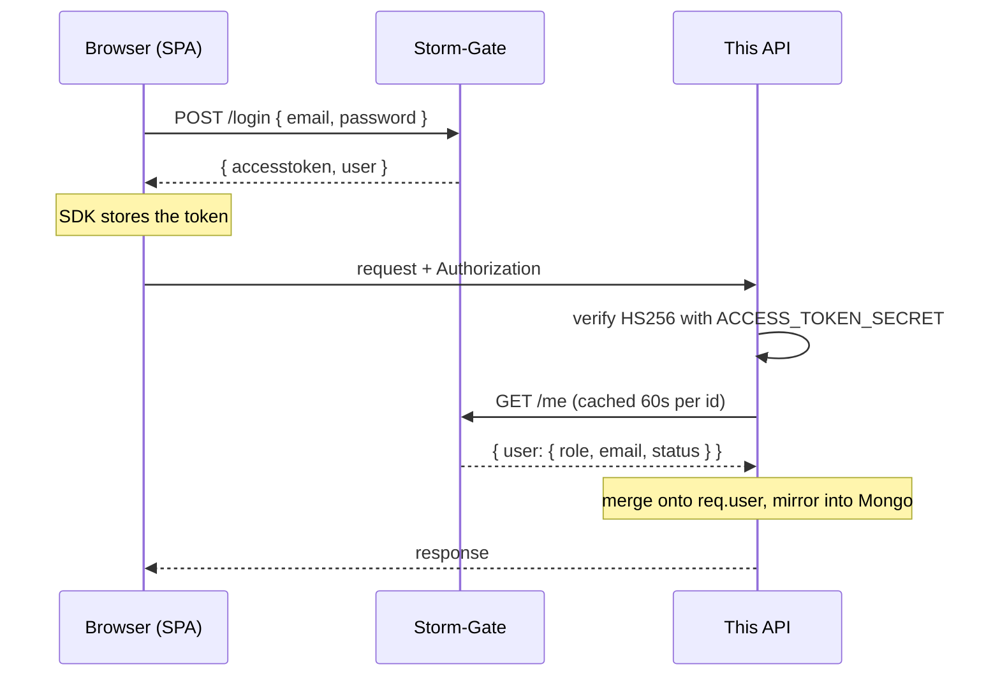

# Authentication

The Storm-Gate integration contract: what the auth service provides, what this app consumes, and the flows a user actually moves through.

Why authentication lives in a separate service is [ADR-001](adr/ADR-001-delegated-auth.md). The security properties — what fails open, what fails closed — are in [SECURITY.md](SECURITY.md). This document is the contract itself.

- [Architecture](#architecture)
- [The Storm-Gate HTTP contract](#the-storm-gate-http-contract)
- [The JWT contract](#the-jwt-contract)
- [How a token moves](#how-a-token-moves)
- [User status flow](#user-status-flow)
- [Consuming auth in components](#consuming-auth-in-components)
- [Protecting a route](#protecting-a-route)
- [Frontend flows](#frontend-flows)
- [Edge cases the SDK absorbs](#edge-cases-the-sdk-absorbs)
- [File map](#file-map)
- [Open contract questions](#open-contract-questions)

---

## Architecture



Storm-Gate issues; this API verifies. They share `ACCESS_TOKEN_SECRET`.

> **This changed.** The original design had the API verify locally and *never* call Storm-Gate. It now calls `/me` on every request (cached 60s) because the token carries only `{ id }` — authorization data is fetched rather than baked in, so a role change or deletion takes effect within the TTL instead of at token expiry. Any older document claiming "the portfolio backend never calls Storm-Gate" describes a design that no longer exists.

---

## The Storm-Gate HTTP contract

Base URL — `REACT_APP_API_BASE_URL`, defaulting to the AWS API Gateway host in production and `http://localhost:8081` in development.

| Method | Path | Body | Success response |
|---|---|---|---|
| `POST` | `/register` | `{ name, email, password, username?, role?, application?, status? }` | `{ accesstoken?, requiresApproval?, user?, msg? }` |
| `POST` | `/login` | `{ email, password, rememberMe? }` | `{ accesstoken, user?, limitedAccess?, msg? }` |
| `GET` | `/me` | — (requires `Authorization`) | `{ user: { id, name, email, role, status, … } }` |
| `POST` | `/logout` | — | `{ msg }` |
| `GET` | `/refresh_token` | — | `{ accesstoken }` |
| `POST` | `/check-status` | `{ email }` | `{ status, msg? }` |
| `POST` | `/forgot-password` | `{ email }` | `{ msg }` |
| `POST` | `/verify-reset-token` | `{ token }` | `{ valid, msg? }` |
| `POST` | `/reset-password/:token` | `{ password }` | `{ msg }` |

Errors are `{ msg: "..." }` with a 4xx/5xx status.

`/me` is the only one this **API** calls. The rest are called by the browser through `@storm-gate/client`.

---

## The JWT contract

The single most important piece of the integration.

- **Secret:** `ACCESS_TOKEN_SECRET`, with `REFRESH_TOKEN_SECRET` for refresh tokens. Identical on both sides.
- **Algorithm:** HS256 — symmetric, so both sides hold the same secret.
- **Claims:** `id` is the only one relied on. `email`, `role` and `status` come from `/me`, not from the token.

Verification is one call:

```js
import { createRequireAuth } from "@storm-gate/express";
const stormGateAuth = createRequireAuth({ secret: process.env.ACCESS_TOKEN_SECRET });
```

That replaced a hand-rolled `jwt.verify` block. The old version returned **400** for an expired token, which broke the client's 401-handling path — one of the concrete reasons the logic moved into a package.

---

## How a token moves

**1. Login.** The SDK posts credentials and stores the returned token, with `rememberMeMaxAge` of 7 days or a 24-hour default.

**2. Attachment.** `sdk.createAuthedAxios({ baseURL })` produces axios instances that attach the token automatically. Two exist:

```js
export const apiLocal      = sdk.createAuthedAxios({ baseURL: LOCAL_API_BASE_URL });    // this API
export const apiStormGate  = sdk.createAuthedAxios({ baseURL: STORM_GATE_BASE_URL });   // auth service
```

**3. Verification.** `utils/auth.js` verifies the signature, enriches `req.user` from `/me`, and upserts a local `Users` row keyed by email.

**4. Logout.** `sdk.logout()`, then `clearLocalSession()` clears `firstLogin`, `isLoggedIn`, `isAdmin` from localStorage and defensively expires the `refreshtoken` cookie the SDK does not own, then redirects to `/login`.

---

## User status flow

Storm-Gate reports one of three statuses:

| Status | Meaning |
|---|---|
| `APPROVED` | Full access |
| `PENDING` | Awaiting admin approval — limited access |
| `DENIED` | Access refused |

Registration can return `{ requiresApproval: true }` **instead of** a token, and login can succeed with a token *and* `limitedAccess: true`.

Storm-Gate refuses a `PENDING` or `DENIED` user at login by returning **200 with a `status` field and no `accesstoken`** — not an error status. `UserAPI.login` branches on that before attempting `getMe()`.

> **The API does not enforce status; the SPA does.** Nothing in `utils/auth.js` or `authAdmin.js` checks it, so a `PENDING` user who obtains a valid token is treated by the backend as a normal authenticated user. Enforcement lives entirely in [`PrivateRoute`](#protecting-a-route) — which means it holds for anyone using the UI and not for anyone calling the API directly. Listed in [SECURITY.md](SECURITY.md#known-gaps).

Admins move a user between statuses with `PATCH /api/user/:id/status`.

---

## Consuming auth in components

`UserAPI` is exposed through `GlobalState`, so components read auth state from context rather than touching the SDK:

```jsx
import { useContext } from 'react';
import { GlobalState } from '../../GlobalState';

const MyComponent = () => {
  const state = useContext(GlobalState);
  const [user]       = state.userAPI.user;
  const [isLoggedIn] = state.userAPI.isLoggedIn;
  const [isAdmin]    = state.userAPI.isAdmin;
  const [loading]    = state.userAPI.loading;
  const [error]      = state.userAPI.error;
  const { login, register, logout } = state.userAPI;
};
```

| Member | Shape | Notes |
|---|---|---|
| `user` | `[user, setUser]` | Storm-Gate profile from `getMe()` |
| `isLoggedIn` | `[bool, setter]` | |
| `isAdmin` | `[bool, setter]` | `role === 1 \|\| role === "admin"` — both forms are accepted because the type has been ambiguous |
| `authenticated` | `[bool, setter]` | |
| `loading` | `[bool, setter]` | **Starts `true`** — the initial `getMe()` has not resolved yet |
| `error` | `[string\|null, setter]` | Last auth error message |
| `cart`, `history`, `addCart` | | Commerce state, colocated here |
| `login`, `register`, `logout` | functions | See below |

**`loading` starts `true`, and that matters.** Any component deciding what to render based on `isLoggedIn` before the first `getMe()` resolves will flash the logged-out view for a signed-in user. Wait on `loading` first.

### The `register` and `login` contract

Both resolve to a **status object rather than throwing** on the approval paths:

```jsx
const result = await register({ name, email, password });
// → { status: "APPROVED" }
// → { status: "PENDING", message, email }

const result = await login({ email, password, rememberMe });
// → { status: "APPROVED", user }
// → { status: "PENDING" | "DENIED", message, email }
```

Only genuine failures throw; a rejected-for-approval login is a resolved promise. Branch on `status`, do not rely on `catch`.

`register` sends `status: "PENDING"` and `application: "blog"` to Storm-Gate, then **mirrors the user into this app's own `Users` collection** via `POST /api/user/register`. That mirror is best-effort — a failure is logged as a warning and registration proceeds, because `utils/auth.js` upserts the same row on the next authenticated request anyway.

`logout` clears local state, `isAdmin` in localStorage, and delegates to the SDK.

---

## Protecting a route

`src/PrivateRouter.js` wraps React Router v5's `Route` and gates on both authentication and **status**:

```jsx
<PrivateRoute type="login" path="/profile" exact={true} element={Profile} />
<PrivateRoute type="admin" path="/admin"   exact={true} element={Dashboard} />
```

| Prop | Purpose |
|---|---|
| `type` | `"login"` — any signed-in user · `"admin"` — `isAdmin && isLoggedIn` |
| `element` | Component to render |
| `isGame` / `Game` | Renders a pre-built game element instead of a component |
| `children` | Used when no `element` is given |

The decision order is deliberate, and each step exists for a reason:

1. **No `accesstoken` cookie** → redirect to `/login`. Never signed in; no need to wait on anything.
2. **Cookie present but `loading` is true** → render a spinner. *Do not decide on stale `localStorage` flags* — that is what causes an admin to be bounced from a page they can access.
3. **`status === "PENDING"`** → redirect to `/pending?email=…`.
4. **`status === "DENIED"`** → redirect to `/denied`.
5. `type="login"` → require `isLoggedIn`; `type="admin"` → require `isAdmin && isLoggedIn`, else redirect to `/`.
6. Anything else → redirect to `/`.

Steps 3 and 4 are defence in depth: they re-check status from the resolved `getMe()` on every navigation, so an admin who denies a user mid-session takes effect on that user's next route change rather than at token expiry.

This is **client-side only**. It controls what the UI shows; it is not a security boundary. The API is the boundary, and it does not check status at all.

---

## Frontend flows

Routes classified in `src/lib/stormGate.js`:

```js
const AUTH_REQUIRED_PREFIXES = ['/admin', '/profile', '/checkout', '/order'];
const PUBLIC_READ_PREFIXES   = ['/blog', '/project', '/about', '/contact', '/login',
                                '/register', '/forgot-password', '/reset-password',
                                '/check-status', '/pending', '/denied'];
```

This drives `isAuthRequiredRoute`, which controls **selective redirect on 401**: an unauthenticated response on `/admin` bounces to `/login`; the same response on `/blog/:slug` does not — the page just renders its logged-out view. A blanket redirect would throw readers off public pages whenever a token expired.

| Flow | Route | Notes |
|---|---|---|
| Register | `/register` | May return `requiresApproval` — show pending message, route to `/login` |
| Login | `/login` | May return `limitedAccess` — full token, reduced permissions |
| Forgot password | `/forgot-password` | Sends a reset email |
| Reset password | `/reset-password?token=…` | Token verified on load, then new password set |
| Check status | `/check-status` | Look up registration status by email |
| Pending / denied | `/pending`, `/denied` | Terminal states |

---

## Edge cases the SDK absorbs

Each of these was hand-written in the app before the package existed, and each is a reason the package exists:

- **Selective 401 redirect** — configurable via `isAuthRequiredRoute`, rather than redirecting on every 401.
- **`requiresApproval` on register** — a success response with no token.
- **`limitedAccess` on login** — a token that grants less than a normal one.
- **Header format** — the old client tolerated a bare JWT *and* a `JWT `-prefixed one. The SDK picks one.
- **Expired-token status code** — normalised, rather than the 400 that broke redirect logic.
- **`rememberMe` lifetimes** — an option, not a hardcoded constant.

---

## File map

| Concern | File |
|---|---|
| Browser SDK instance, route classification, logout | `src/lib/stormGate.js` |
| Authed axios for this API / for Storm-Gate | `src/lib/stormGate.js` → `apiLocal`, `apiStormGate` |
| Friendly error mapping | `src/lib/stormGate.js` → `friendlyAuthError` |
| JWT verification + `/me` enrichment + user mirroring | `utils/auth.js` |
| Admin gate | `utils/authAdmin.js` |
| Soft auth for public-but-personalised routes | `utils/optionalAuth.js` |
| Local mirror of Storm-Gate users | `models/user.js` |
| Auth state in React context | `src/API/UserAPI.jsx` → `state.userAPI` |
| Client-side route protection and status gating | `src/PrivateRouter.js` |
| Auth pages | `src/Pages/Auth/` — `login`, `register`, `forgotPassword`, `resetPassword`, `checkStatus`, `pending`, `denied`, plus `AuthShell` and `Mobile/` |
| Shared auth styling | `src/Pages/Auth/auth.css` |
| Test token minting and `/me` mocking | `test/helpers/auth.cjs` |

`src/services/authService.js` — roughly 200 lines of hand-rolled axios interceptors, cookie parsing and redirect logic — **no longer exists**. `createStormGateClient` replaced it.

---

## Open contract questions

Carried forward because they are still unresolved, and each one is a real ambiguity:

1. **Symmetric vs asymmetric signing.** HS256 means every consumer holds the signing secret and could mint tokens. RS256 with a JWKS endpoint would remove secret distribution entirely — the single biggest improvement available to this contract.
2. **Logout semantics.** Is `/logout` real revocation, or just a cookie clear? Consumers need to know whether an old token stays valid until `exp`. (Today this API assumes it does, and mitigates with the per-request `/me` reload.)
3. **Refresh-token rotation.** `/refresh_token` is a `GET` with no body — which cookie or header does it read, and what is the rotation policy?
4. **`role` type.** This app compares against both `1` and `"admin"` because the type has been ambiguous. One type, documented.
5. **Cookie domain and CORS.** When Storm-Gate is on a different origin, cookie-based token storage needs either `withCredentials` HttpOnly cookies set by Storm-Gate, or a token-in-memory mode.
6. **The `application` field** on `/register`. This app sends the literal `"blog"`. The allowed values and what behaviour they change are still undocumented on the Storm-Gate side — it appears to be multi-tenant partitioning, but nothing here depends on that being true.

---

## Planned improvements

Auth capabilities this integration does not have yet, roughly in value order:

1. **Rate limiting on sign-in** — credential stuffing is unmitigated, and this is the single biggest gap ([SECURITY.md](SECURITY.md#known-gaps))
2. **Email verification** on registration
3. **Session timeout warnings** before a token expires
4. **Two-factor authentication**
5. **Social / OAuth sign-in**
6. **Stronger password requirements** with a strength meter
7. **Remember-this-device**

Most belong in Storm-Gate rather than here, which is the point of [ADR-001](adr/ADR-001-delegated-auth.md) — implementing them once benefits every consumer.
