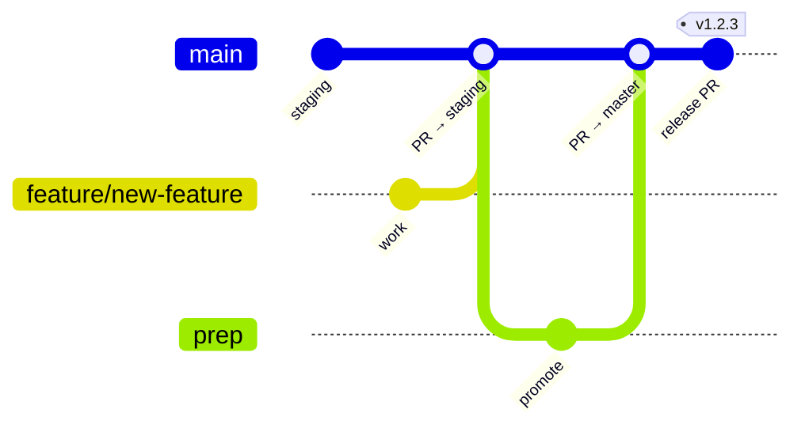

# Contributing

Branching, commits, and how a change gets from a working tree to production.

The pipelines themselves are in [OPERATIONS.md](OPERATIONS.md#branches-and-pipelines); this is the workflow around them.

- [Branches](#branches)
- [Workflow at a glance](#workflow-at-a-glance)
- [Feature flow](#feature-flow)
- [Hotfix flow](#hotfix-flow)
- [Branch management](#branch-management)
- [Commit messages](#commit-messages)
- [Pull requests](#pull-requests)
- [Testing per branch](#testing-per-branch)
- [Deployment pipelines](#deployment-pipelines)
- [Version tagging](#version-tagging)
- [Releases](#releases)
- [Rollback](#rollback)
- [Branch protection](#branch-protection)
- [Documentation](#documentation)
- [Contact](#contact)

---

## Branches

**Core branches** — long-lived, never deleted.

| Branch | Purpose | Environment | CI | Deploys |
|---|---|---|---|---|
| `master` | Production-ready code | Production | Snyk scan, build, release-please | **Yes**, via `v*` tag |
| `prep` | Pre-production staging area | Pre-production | **None** | No |
| `staging` | Integration and testing | Development | Full Dev Pipeline | No |

**Supporting branches** — temporary, deleted after merge.

| Type | Purpose | Naming | Branches from |
|---|---|---|---|
| Feature | New feature development | `feature/<feature-name>` | `staging` |
| Bugfix | Non-urgent bug fixes | `bugfix/<bug-name>` or `fix/<name>` | `staging` |
| Hotfix | Emergency fixes | `hotfix/<issue-name>` | `master` |

The intended long-term flow is **feature → `staging` → `prep` → `master`**, as described in the [pull request template](https://github.com/HoseaCodes/Blog-Portfolio/blob/master/.github/pull_request_template.md).

Two caveats that the branch table cannot show, and that matter more than the table:

> **`staging` verifies but never ships.** It runs scans, lint, the integration suite and a production build, then stops. It cuts no release and deploys nowhere.

> **`prep` has no CI at all.** No workflow triggers on it. Checks displayed on a PR *targeting* `prep` are `staging`'s runs against staging's head commit — they say nothing about the merge result. `prep`'s own workflow copies are stale: they still trigger on `staging` and have no `integration-test` job.

---

## Workflow at a glance



```
feature/branch                          hotfix/branch
      |                                       |
      v                                       v
  staging  ───────►  prep  ───────►  master ◄─┘
   (Dev)          (Pre-prod)          (Prod)
      ▲                                  │
      └────────── port hotfix back ───────┘
```

A hotfix branches from `master` and must be **ported back** to `staging`, or the next promotion reverts it.

---

## Feature flow

```bash
git checkout staging && git pull
git checkout -b feature/new-feature

# work, committing in logical chunks

git checkout staging && git pull
git checkout feature/new-feature
git merge staging          # keep current with the parent
```

Then open a PR into `staging`. Once the Dev Pipeline is green and the review is addressed, merge. Promote by opening `staging` → `prep`, then `prep` → `master`. Merging to `master` starts the release machinery.

---

## Hotfix flow

```bash
git checkout master && git pull
git checkout -b hotfix/critical-issue
# fix, test locally
```

PR into `master`. Once merged and deployed, **port it back**: open a second PR into `staging` (and `prep` if it is mid-flight), or the next promotion silently reverts the fix.

Tag the hotfix on `master` — or rather, let release-please do it. See [Version tagging](#version-tagging).

---

## Branch management

**Keep branches current.** Merge or rebase from the parent regularly and resolve conflicts promptly. A long-lived branch that has not seen its parent in a week is a merge conflict you have not met yet.

**Delete after merge.**

```bash
git branch -d feature/completed-feature          # local
git push origin --delete feature/completed-feature   # remote
```

**Squash merging.** Squash keeps `master` history clean:

```bash
git merge --squash feature/new-feature
git commit -m "feat(articles): add scheduled publishing"
```

> **Squash carefully — the squashed message becomes the release note.** release-please reads commit types to compute the version bump. Flattening a set of `feat:` and `fix:` commits into one `chore:` silently drops all of them from `CHANGELOG.md` and produces no version bump. If you squash, give the result the type of the most significant change in it.

---

## Commit messages

**This repository uses [Conventional Commits](https://www.conventionalcommits.org/), and it is not a style preference — release-please parses them.** The commit type decides the version bump and whether the change appears in `CHANGELOG.md` at all.

```
<type>(<scope>): <summary in the imperative, ~50 chars>

<body — why, not what, wrapped at 72>

Resolves #123
```

| Type | Effect on the release |
|---|---|
| `feat` | **Minor** bump, appears in the changelog |
| `fix` | **Patch** bump, appears in the changelog |
| `docs`, `test`, `chore`, `refactor`, `style`, `ci` | No bump, generally not in the changelog |
| `feat!` / `BREAKING CHANGE:` footer | **Major** bump |

Real examples from this repository:

```
fix(ci): install the build job from the lockfile instead of deleting it
feat(*): add integration tests for Articles and Subscribers APIs
docs(readme): correct how conventional-changelog picks the next version
test(articles): assert the seed create in the duplicate-id test
```

Conventions:

- **Imperative mood** — "add feature", not "added feature".
- **Summary line under ~50 characters**, no trailing period.
- **Body explains why.** The diff already shows what.
- **One logical change per commit.** Do not combine unrelated work.
- **Commit often** — small commits are easier to review and to revert.

A commit that fixes something subtle should say what it was guarding against, not just what it changed. The [OPERATIONS gotchas](OPERATIONS.md#pipeline-gotchas) exist because those commits did.

---

## Pull requests

Fill in the [template](https://github.com/HoseaCodes/Blog-Portfolio/blob/master/.github/pull_request_template.md): source branch, target branch, description, related issues, and the checklist.

Before requesting review:

- [ ] `npm run test:integration` passes locally (needs Docker)
- [ ] `npm run lint` produces no new findings
- [ ] Documentation updated if behaviour changed — see below
- [ ] The branch flow above was followed

Note that lint and the Snyk scans are **advisory in CI** (`continue-on-error`), so a green pipeline does not mean they are clean. Read them.

---

## Testing per branch

What each branch is *meant* to run, and what it actually runs today:

| Branch | Intended | Actually runs |
|---|---|---|
| All branches | Unit tests | Nothing — no workflow triggers on feature branches |
| `staging` | Integration tests | ✅ Integration tests, plus scans, lint and a production build |
| `prep` | End-to-end and performance tests | Nothing — no workflow triggers on `prep` |
| `master` | Smoke tests | Snyk scan and a build. No smoke test after deploy |

Three of those four rows are aspirations. The gaps that matter most, in order: **no post-deploy smoke test** (nothing verifies production came back up), **no E2E suite** anywhere, and **no unit tests on feature branches** — which is moot until the [12 empty unit suites](TESTING.md#the-state-of-the-unit-tier) are filled or deleted.

---

## Deployment pipelines

| Branch | Environment | Trigger | Reality |
|---|---|---|---|
| `staging` | Development | Push | **Verifies only — no deploy** |
| `prep` | Pre-production | Push | **No pipeline, no environment** |
| `master` | Production | `v*.*.*` tag from the release PR | ✅ Deploys to Fly.io |

There is exactly **one** deploy path, and it is tag-driven rather than merge-driven — merging to `master` does not deploy; merging the *release PR* does. Full mechanics in [OPERATIONS.md](OPERATIONS.md#releases-and-deploys).

There is no separate pre-production environment. `prep` is a promotion gate on paper only.

---

## Version tagging

**Semantic versioning** — `MAJOR.MINOR.PATCH`. The bump is derived from commit types, not chosen by hand:

| Commits since last release | Bump |
|---|---|
| Any `feat!:` or `BREAKING CHANGE:` footer | MAJOR |
| Any `feat:` | MINOR |
| Only `fix:` | PATCH |
| Only `docs:`/`chore:`/`test:`/`ci:` | No release |

Every production release is tagged on `master`, and release notes are generated into `CHANGELOG.md` from the commit bodies — which is the practical reason a commit body should say *why*.

**Do not create tags by hand.**

```bash
git tag -a v1.2.3 -m "Release version 1.2.3"   # ← don't
```

Two independent tag namespaces exist: `v*` (release-please, drives the deploy) and `dev.v*` (conventional-changelog on `master`, consumed by nothing). A hand-made tag either collides with the computed sequence or fires a deploy from an unexpected commit — the failure that [deadlocked releases on `staging`](OPERATIONS.md#pipeline-gotchas) came from exactly this class of mistake.

---

## Releases

Automatic, and single-path:

1. Merge to `master` with conventional commits.
2. release-please opens or updates a release PR, with the computed version and changelog.
3. Merging that PR bumps `package.json`, writes `CHANGELOG.md`, and pushes a `v*.*.*` tag.
4. The tag fires `release-publish.yml`, which deploys to Fly.io.

Do not hand-tag releases. Versions come from commit types, and a manual tag either collides with the sequence or fires a deploy from an unexpected commit — see the [tag-reachability failure](OPERATIONS.md#pipeline-gotchas) that broke releases on `staging` for exactly this reason.

---

## Rollback

```bash
git revert <commit-hash>     # then let the normal release flow ship it
```

Or redeploy the previous release tag:

```bash
git checkout v1.2.3      # the last known-good release
fly deploy               # break-glass; normally let the tag flow do it
```

See [OPERATIONS.md](OPERATIONS.md#restart-and-rollback) for restart and health checks.

---

## Branch protection

`staging` is protected — **changes must go through a pull request**. This has a consequence that is not obvious until it bites: a workflow step that tries to push a commit is rejected with `GH006: Protected branch update failed`, but **tags are not covered by the rule**, so a rejected push can still leave a tag behind pointing at a commit that never landed. That asymmetry is what broke release automation on `staging`.

Still to configure:

- [ ] Require PR review before merging on `master` and `prep`
- [ ] Require status checks to pass before merging — today the Dev Pipeline can be red and the merge button still works
- [ ] Enforce branch naming conventions
- [ ] Give `prep` a pipeline, or drop it from the flow and stop implying it is a gate

The second item is the one that changes behaviour most: until required status checks are on, every rule in this document is a convention rather than a constraint.

---

## Documentation

Update `docs/` in the **same pull request** as the change that makes it true. This project moved its documentation out of a wiki precisely because a wiki is not reviewed alongside the code, and drifts invisibly — it ended up describing PM2, SendGrid and a `swagger-server` that no longer existed.

Two places carry a standing obligation to be updated together with their code:

- [BLOG_PAGE_LOGIC.md](BLOG_PAGE_LOGIC.md) and the comment block above `fetchMostLikedArticle` in `src/Pages/Articles/Articles.jsx`
- [ARCHITECTURE.md § mount ordering](ARCHITECTURE.md#mount-ordering--a-real-invariant) and the mount comments in `app.js`

If a decision was hard to reverse or will be questioned later, write an [ADR](adr/README.md) instead of a comment.

---

## Contact

Questions about this workflow go to the repository maintainer — Dominique Hosea ([@HoseaCodes](https://github.com/HoseaCodes)). For anything exploitable, use a [private security advisory](https://github.com/HoseaCodes/Blog-Portfolio/security/advisories) rather than an issue, per [SECURITY.md](SECURITY.md#reporting-a-vulnerability).
